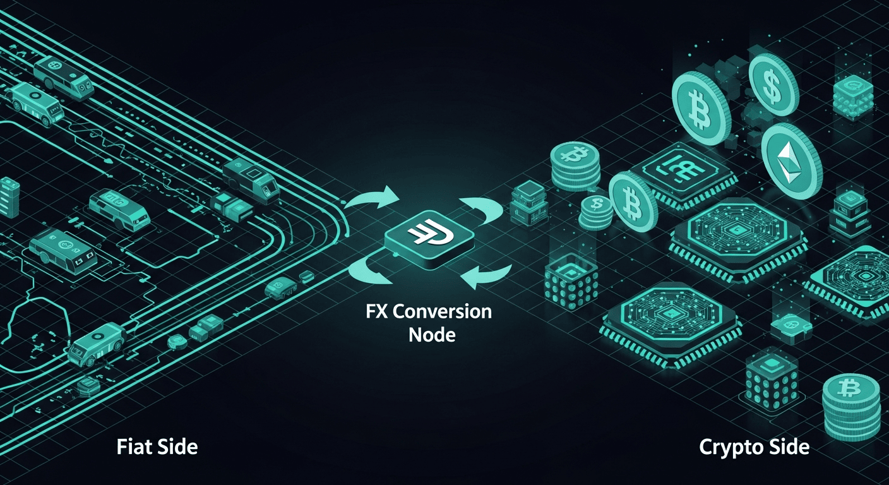

# Cross-Border Payment Gateway

## Overview
Docs-only case study of a cross-border payment gateway, documenting payment orchestration, FX/pricing, ledgering, compliance screening, fraud controls, and settlement/reconciliation operations.

## Start here
**[Open the Documentation Index](./docs/00-index.md)**

## Documentation
- [00 — Index](./docs/00-index.md)
- [01 — Gateway Overview](./docs/01-gateway-overview.md)
- [02 — Payment Flows & Orchestration](./docs/02-payment-flows-and-orchestration.md)
- [03 — FX, Pricing & Ledgering](./docs/03-fx-pricing-and-ledgering.md)
- [04 — Compliance (KYC/AML) & Screening](./docs/04-compliance-and-screening.md)
- [05 — Risk, Fraud & Disputes](./docs/05-risk-fraud-and-disputes.md)
- [06 — Settlement, Reconciliation & Operations](./docs/06-settlement-reconciliation-and-operations.md)

## Notes
- No proprietary source code included.
- Relative links are used so everything opens correctly from the repo root.
